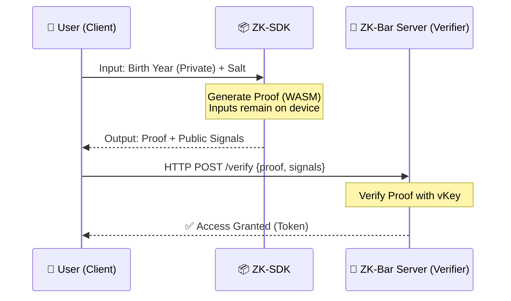

# 🍺 ZK-Bar: Zero-Knowledge Identity Verification SDK

> A privacy-preserving authentication system that proves **"I am old enough"** without revealing **"How old I am"**.


## 📖 Introduction (專案簡介)

**ZK-Bar** 是一個基於零知識證明 (Zero-Knowledge Proofs, ZKPs) 的身分驗證解決方案。它允許使用者向服務提供者證明其符合特定條件（如：年齡大於 18 歲），而**無需上傳身分證照片或洩露具體出生日期**。

本專案包含：

1.  **Core Circuits**: 使用 Circom 撰寫的 ZK 電路。
2.  **ZK-Login SDK**: 封裝好的 JavaScript SDK，供開發者快速整合。
3.  **PoC Server**: 模擬驗證流程的後端範例。

## 🏗 Architecture (系統架構)



## 🚀 Quick Start (快速開始)

### Prerequisites

- Node.js v18+
- Rust (for compiling circuits)

### Installation

```bash
git clone [https://github.com/YourUsername/ZK-Login.git](https://github.com/YourUsername/ZK-Login.git)
cd ZK-Login
npm install
```

### 1\. Build Circuits & Trusted Setup

Compile the circuits and generate the keys:

```bash
# This will compile .circom files and perform Phase 2 setup
# Ensure you have 'circom' installed or use the pre-built artifacts in build/
npm run build
# (You might need to add a build script to package.json, or run commands manually)
```

### 2\. Run the Server

Start the verification backend:

```bash
node server.js
```

### 3\. Run the Client Test

Simulate a user generating a proof and sending it to the server:

```bash
node tests/test_api.js
```

## 🛠 Tech Stack (技術堆疊)

- **ZK Circuits**: Circom 2.0
- **Proving System**: Groth16 (SnarkJS)
- **Runtime**: Node.js
- **API**: Express.js

## 🔒 Security & Privacy

- **Data Minimization**: The Verifier never sees the `birthYear`.
- **Completeness**: If the statement is true, an honest verifier will be convinced.
- **Soundness**: If the statement is false, no cheating prover can convince the verifier.
- **Zero-Knowledge**: The verifier learns nothing else about the secret input.

---

_Developed by 9ames7uan - 2025_
