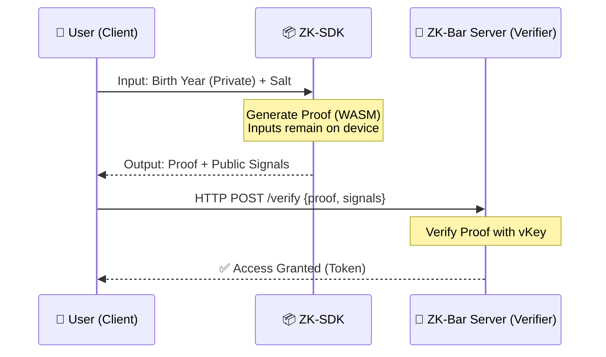

# 🍺 ZK-Bar: Zero-Knowledge Identity Verification SDK

> A privacy-preserving authentication system that proves **"I am old enough"** without revealing **"How old I am"**.


## 📖 Introduction

**ZK-Bar** is a privacy-preserving identity verification solution based on Zero-Knowledge Proofs (ZKPs). It allows users to prove they meet specific criteria (e.g., being over 18 years old) to service providers **without uploading ID photos or revealing their exact date of birth**.

This project includes:

1.  **Core Circuits**: ZK circuits written in Circom.
2.  **ZK-Login SDK**: A pre-packaged JavaScript SDK for rapid developer integration.
3.  **PoC Server**: A backend example simulating the verification process.

## 🏗 Architecture



## 🚀 Quick Start

### Prerequisites

- Node.js v18+
- Rust (for compiling circuits)

### Installation

```bash
git clone [https://github.com/YourUsername/ZK-Login.git](https://github.com/YourUsername/ZK-Login.git)
cd ZK-Login
npm install
```

### 1\. Build Circuits & Trusted Setup

Compile the circuits and generate the keys:

```bash
# This will compile .circom files and perform Phase 2 setup
# Ensure you have 'circom' installed or use the pre-built artifacts in build/
npm run build
# (You might need to add a build script to package.json, or run commands manually)
```

### 2\. Run the Server

Start the verification backend:

```bash
node server.js
```

### 3\. Run the Client Test

Simulate a user generating a proof and sending it to the server:

```bash
node tests/test_api.js
```

## 🛠 Tech Stack

- **ZK Circuits**: Circom 2.0
- **Proving System**: Groth16 (SnarkJS)
- **Runtime**: Node.js
- **API**: Express.js

## 🔒 Security & Privacy

- **Data Minimization**: The Verifier never sees the `birthYear`.
- **Completeness**: If the statement is true, an honest verifier will be convinced.
- **Soundness**: If the statement is false, no cheating prover can convince the verifier.
- **Zero-Knowledge**: The verifier learns nothing else about the secret input.

---

_Developed by 9ames7uan - 2025_
