# 🍷 ZK-Bar: Zero-Knowledge Identity Verification (Full Stack)

> A privacy-preserving authentication system that proves **"I am old enough"** without revealing **"How old I am"**, backed by **Government EdDSA Signatures**.


## 📖 Introduction

**ZK-Bar** is a full-stack Zero-Knowledge Proof (ZKP) demonstration. It simulates a real-world scenario where a user proves their age to a venue (e.g., a bar) using a digital identity issued by the government.

**Key Features:**

- **Privacy First**: The venue never sees the user's birth year.
- **Authority Backed**: Uses **EdDSA Signatures** (BabyJubJub curve) to ensure the identity data is signed by a trusted issuer (Government).
- **Browser Compatible**: ZK Proofs are generated client-side using WebAssembly (WASM).

## 🏗 System Architecture

```mermaid
sequenceDiagram
    participant Gov as 🏛️ Government (Issuer)
    participant User as 👤 User (Browser)
    participant Server as 🍷 ZK-Bar (Verifier)

    Note over Gov: 1. Setup Phase
    Gov->>User: Issue ID (Signed BirthYear + Signature)

    Note over User: 2. Login Phase
    User->>User: Input: ID + Gov Signature
    User->>User: Generate ZK Proof (WASM)
    User->>Server: HTTP POST /verify {proof, publicSignals}

    Note over Server: 3. Verification Phase
    Server->>Server: Verify Proof (Math + Signature Check)
    Server-->>User: ✅ Access Granted (Entry Token)
```



## 🚀 Quick Start

### Prerequisites

- Node.js v18+
- Rust (for compiling circuits)

### Installation

Bash

```
git clone [https://github.com/9ames7uan/ZK-Login.git](https://github.com/9ames7uan/ZK-Login.git)
cd ZK-Login
npm install
```

### 1. Build Circuits (Phase 2: EdDSA)

Compile the circuits that include signature verification logic:

Bash

```
# This compiles the circuit and performs the Trusted Setup (Power 14)
npm run build
```

### 2. Issue Digital Identity

Simulate the Government issuing a digital ID card to the user:

Bash

```
# Generates tests/identity_card.json signed by a mock Government private key
node scripts/government_issue.js
```

### 3. Run the Full Stack App

Start the Web Server and API:

Bash

```
node server.js
```

> **Live Demo**: Open your browser and go to **http://localhost:3000**

## 🛠 Tech Stack

- **Circuits**: Circom 2.0 (Logic + EdDSA Verification)
- **Cryptography**: SnarkJS (Groth16), Circomlibjs (EdDSA/MiMC)
- **Backend**: Node.js, Express
- **Frontend**: HTML5, Vanilla JS (Client-side Proving)

## 🔒 Security Model

1. **Trust Anchor**: The system relies on the Government's Public Key hardcoded (or passed) to the verifier.
2. **Data Integrity**: The Circuit verifies `EdDSAMiMCVerify(GovPubKey, Hash(BirthYear), Signature) === True`.
3. **Predicate Logic**: The Circuit verifies `CurrentYear - BirthYear >= 18`.
4. **Zero Knowledge**: Only the Proof and Public Signals (isAdult) are sent to the server.

---

_Developed by 9ames7uan - 2025_
